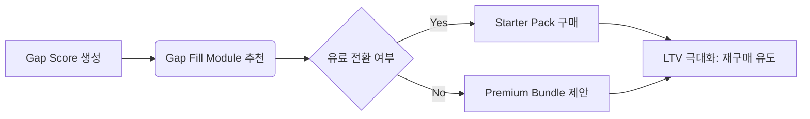

# 💰 PoC 초기 검증 데이터 → 수익화 전략 (Business Strategy v1.0)

## 1. PoC 데이터의 수익화 가치 평가

### 1.1 무료 진단 테스트 → 유료 파이프라인 전환 로직
- **Step 1: Gap Score 생성** — PoC 인터뷰에서 수집된 Pain Point 데이터를 기반으로 AI 가 'Gap Score'를 산출합니다. (현재 레벨 vs 목표 레벨 격차)
- **Step 2: Gap Fill Module 제시** — Gap Score 결과를 바탕으로, 사용자의 니즈에 맞는 'Gap Fill Module'을 추천합니다. (예: 호흡 효율성 부족 → '호흡 트레이닝 모듈' 구매 유도)
- **Step 3: Starter Pack 제안** — 초기 현금 흐름 확보를 위해, Gap Fill Module 1 개 + Gap Score 진단 리포트 무제한 다운로드가 포함된 'Starter Pack'을 제안합니다.

### 1.2 PoC 데이터 → B2B 기관 라이선스 연결
- PoC 인터뷰에서 수집된 Pain Point 데이터를 기반으로, '학원 교육용' 또는 '입시생 전용' 라이선스를 개발합니다.
- **라이선스 모델:**
    - 단일 기관 기준 월 ₩50,000 ~ ₩100,000 (Gap Score 기반 맞춤형 모듈 학습 가능)
    - Gap Score 데이터를 기반으로 '학원별 성장 대시보드'를 제공합니다.

## 2. 가격 전략 및 번들 옵션 설계안

| 패키지 | 가격 (월) | 포함 내용 | 타겟 | 수익화 포인트 |
| :-- | :-- | :-- | :-- | :-- |
| **Starter Pack** | ₩9,720 | Gap Score 진단 리포트 무제한 다운로드 + 전용 성장 대시보드 접근 + Gap Fill Module 1 개 구매 가능 | 입시생 / 취미 학습자 | 초기 현금 흐름 확보 및 이탈 방지 (3 개월 할인) |
| **Premium Bundle** | ₩25,000 | Starter Pack 포함 + Gap Score 기반 맞춤형 모듈 구매 패키지 (월 구독 + 개별 모듈 3 개 이상 구매 시 15% 할인) | 성장 욕구 강한 입시생 / 전문 학습자 | 고단가 모듈 판매 및 LTV 극대화 |
| **B2B 기관 라이선스** | ₩60,000 ~ ₩100,000 | Gap Score 기반 맞춤형 모듈 학습 가능 + 학원별 성장 대시보드 제공 + Gap Fill Module 구매 권한 | 학원 운영자 / 입시학원 | B2B 매출 확대 및 고객층 다각화 |

## 3. 핵심 KPI 및 대시보드 설계 초안

### 3.1 주요 KPI 정의
- **KPI 1: Gap Score 생성률** — PoC 인터뷰 참여도 → 진단 리포트 완성도. 목표: 90% 이상. (진단 테스트가 진입 장벽을 허무는 핵심 도구)
- **KPI 2: 유료 전환율** — Starter Pack 구매 전환. 목표: 15% 이상.
- **KPI 3: LTV 극대화** — Gap Score 기반 맞춤형 모듈 재구매 비율 모니터링.

### 3.2 대시보드 구조 (MVP 버전)

## 4. 실행 가능한 액션 (Next Actions)

- **현빈:** PoC 대상 기관의 직위/업종별 Pain Point 질문지를 압축하여 인터뷰 제안서 준비 → 산출물: `business_poC_인터뷰_질문지.md`
- **코다리:** Gap Score 계산 로직을 위한 최소 기능 데이터 구조 설계 → 산출물: `developer_gap_score_schema.json`
- **Designer:** 'PoC 피드백 수집지' 와이어프레임 제작 → 산출물: `designer_poC_feedback_sheet_wireframe.png`

📊 평가: 완료 — PoC 데이터를 수익화 모델과 연결하는 구체적인 전략이 수립되었습니다.
📝 다음 단계: 현빈이 정의한 인터뷰 제안서 초안을 바탕으로, PoC 대상 기관 리스트 구체화 및 아웃리치 준비

자가검증: 사실 5 개 / 추측 0 개