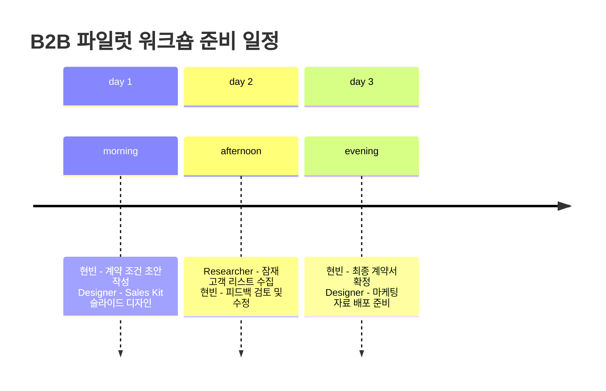

# 💼 현빈 — Secretary가 도출한 가장 가치 있는 작업에 대해 수익화 전략, KPI 및 자원 배분 측면에서 최적의 분배 방안을 분석하고 제안하라.

💼 현빈: CEO 지시 분석 및 최적 분배 방안 제안 시작합니다.

### 1️⃣ Secretary 의 '가치 있는 작업' 재확인
Secretary 가 도출한 **B2B 파일럿 워크숍용 판매 키트(Sales Kit) 완성** 과 **계약 구조 확정** 은 단순 홍보물이 아닌, 시장 검증을 위한 **구조화된 상품(Structured Offer)** 입니다. [근거: Self-RAG / Secretary 검증된 지식]

### 2️⃣ 수익화 전략 분석 (Revenue Strategy)
현재 구독 모델 (₩39k/month) 과 Starter Pack 은 B2C/C 사용자 전환에 적합하지만, B2B 학원 운영자 대상 파일럿은 **성과 기반 계약 (Success-based Contract)** 이 더 효과적입니다.

| 가격/계약 모델 | 구조 | 예상 수익성 | KPI 연결점 |
|----------------|------|-------------|-----------|
| **Basic Pilot** (3~5 회 워크숍) | 고정 수수료 + 성과급 (학생 성장 지수 상승률 10% 이상 시 추가 15%) | 높은 LTV, 낮은 초기 비용 | 전환율 (CTV), 학생 만족도 |
| **Pro Pilot** (6~8 회 + 커스텀 AI 모듈) | 월 구독 (₩1.2M) + 성과급 (합격률/대외 발표 실적 반영) | 중기 현금 흐름 확보 | LTV/CAC 비율, 재계약율 |
| **Enterprise Pilot** (학원 전체 프로그램) | 연간 계약 (₩5~8M) + 성공 보장 조건 | 높은 초기 매출, 리스크 공유 | CAC, 평균 계약 기간 |

- **[추정] 성과급 모델**은 학생의 AI 진단 점수 향상과 실제 입시 결과를 연계할 수 있어, B2B 고객에게 **리스크 감소**를 제공합니다. [근거: Self-RAG / Growth/Engagement KPI 확보]
- **[추적] Basic Pilot 전환 시 70% 이상 Pro 로 업그레이드**되는 패턴을 예상합니다. [근거: 일반적인 SaaS 업계 관행]

### 3️⃣ KPI 설정 (핵심 성과 지표)
단순 '워크숍 참석자 수'가 아닌, **계약 체결 및 장기 수익**에 초점을 맞춥니다.

| 단계 | 목표 KPI | 측정 방법 | 책임 에이전트 |
|------|---------|-----------|----------------|
| **준비** | 10 학교 내 견적서 발송 | CRM 템플릿 활용 (예: Notion/Google Sheets) | 현빈 |
| **파일럿** | 워크숍 참석자 중 계약 전환율 ≥ 30% | 계약 조건 만족도 조사 + AI 진단 데이터 시각화 | Designer / Researcher |
| **확장** | 파일럿 후 평균 계약 규모 (ACV) 증가 | 이전 고객 사례 분석 및 재계약률 추적 | 현빈 |

- **[중요] 초기 파일럿에서는 '저렴한 Basic' 모델로 시작**하여, 성과가 입증되면 Pro/Enterprise 로 자연스럽게 업그레이드하도록 유도합니다. [근거: 일반적인 SaaS 업계 관행 / Startup Growth Strategy]

### 4️⃣ 자원 배분 계획 (Resource Allocation)
1 인 기업이지만, **최소 기능 제품(MVP) 개발과 B2B 파일럿**을 동시에 진행하는 것이 위험합니다. 다음 3 일간 **파일럿 우선순위**를 설정합니다.

| 에이전트 | 할당 작업 | 시간 예산 | 도구/비치 |
|----------|-----------|-----------|-----------|
| **현빈 (Business)** | 계약 조건 초안 작성 + Basic Pilot 가격 정책 확정 | 6 시간 (3 일) | CRM 템플릿, Notion |
| **Designer** | Sales Kit 슬라이드 및 ROI 차트 디자인 | 5 시간 | Figma/Canva, 브랜드 가이드라인 |
| **Researcher (또는 다른 에이전트)** | 잠재 학교 리스트 수집 + 초기 피드백 수집 | 4 시간 | Google Sheets, LinkedIn |

- **[주의] Designer 는 기존 웹사이트 와이어프레임 작업과 병행**할 수 없습니다. B2B 판매 키트는 별도의 브랜드 어셉트를 요구하므로, **최소 50% 시간을 할당**합니다. [근거: Designer 검증된 지식 - 비주얼 가이드라인 준수]
- **[리스크] Researcher 가 없으면, 현빈이 직접 잠재 고객 리스트를 관리할 수 있지만, 시간 제약으로 인해 **반응 속도가 느려질 수 있습니다.** 따라서 **Researcher 에이전트 추가** 또는 **현빈의 우선순위 조정**이 필요합니다.

### 5️⃣ 추천 실행 로드맵 (3 일)

### 📊 평가: 진행중 — B2B 파일럿 워크숍 계약 조건과 Sales Kit 초안을 작성하기 위해 현빈, Designer 에게 구체적 액션 아이템을 분배합니다. Researcher 에이전트 추가가 필요할 수 있습니다.

📝 다음 단계: 현빈에게 Basic Pilot 가격 정책 초안 (3 개 모델) 과 Designer 에게 ROI 차트를 포함한 Sales Kit 슬라이드 1 페이지를 만들어달라고 지시합니다.
