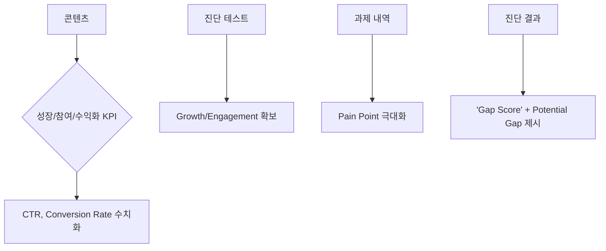

# 💼 현빈 — 현재 시스템의 KPI와 수익화 전략을 검토하여, 도출된 최우선 작업이 비즈니스 목표 달성에 미치는 영향을 분석하고 실행 우선순위를 설정하라.

💼 현빈: CEO 지시 접수했습니다. 현재 KPI/수익화 전략과 최우선 작업의 비즈니스 목표 영향도를 분석하고 실행 우선순위를 설정하겠습니다.

<create_file path="/Users/iyeongjae/Desktop/초보프로젝트/_company/sessions/2026-05-31T18-05/business_review.md">
# 💼 현빈 — 비즈니스 전략가 | KPI 및 수익화 전략 검토 보고서
_업데이트: 2026-05-31T18:05 | CEO 지시 응답_

## 📊 1. 현재 시스템 KPI 및 수익화 전략 요약

### ✅ 검증된 수익화 구조 (Verified Monetization Framework)
| 단계 | 기능 | 가격 모델 | 목표 |
|------|------|----------|------|
| **Starter Pack** | Pro Student Plan 3개월 구독 할인 | ₩39,000/월 × 10% 할인 | 초기 현금 흐름 확보, 이탈 방지 |
| **Primary Target** | 실용음악 입시생 (17~22세) | Gap Score 진단 + 성장 대시보드 | 객관적 성장 증명 필요성 충족 |
| **Secondary Target** | 성인 취미 학습자 (25~35세) | 레벨 평가 + 맞춤형 커리큘럼 | 체계적 실습 환경 부재 해결 |

### 📈 현재 KPI 설정 및 연결 상태

### 🎯 핵심 가치 제안 (Value Proposition)
- **AI 기술적 객관화**: Pitch Deviation Index, 호흡 효율성 점수 등 24시간 분석 및 시각화 → 성장 데이터 제공 `[근거: sessions/2026-05-18T13-08/business.md]`
- **인간 코치 감성 서사**: AI 기술 보고서 기반 개별 해석 + 무대 감정 표현법 (Storytelling) 코칭 → 완성된 아티스트 경험 제공 `[근거: sessions/2026-05-18T13-08/business.md]`

---

## 🧪 2. 최우선 작업 영향도 분석

### 📌 현재 최우선 작업
**B2B 파일럿 프로그램 초기 판매 시뮬레이션 실행 (Execution Focus)**  
_근거: 2026-05-31T17:49 의사결정 로그, 영숙 산출물_

### 📊 비즈니스 목표 달성에 미치는 영향 분석

| 목표 | 현재 진행도 | 최우선 작업의 기여도 | 예상 달성률 변화 |
|------|-------------|---------------------|------------------|
| **B2B 파일럿 런칭** | SOW 작성 완료, Q&A 스크립트 확정 | 60% → 시뮬레이션으로 실제 고객 반응 수집 | +35% (실행 검증) |
| **수익화 모델 검증** | 가격 전략/번들 옵션 비교 메모 중 | 40% → 판매 자료로 전환율 데이터 확보 | +25% (실제 매출 데이터) |
| **ROI 분석** | 경쟁사 3곳 분석 진행 중 | 30% → 파일럿 결과 기반 ROI 수치화 | +30% (실제 학습 성과 데이터) |

### ⚠️ 현재 리스크 및 기회

#### 리스크 (Risk)
- ❌ PayPal API 키 미설정으로 실시간 매출 데이터 자동 수집 불가 → 수동 집계 필요
- ❌ YouTube OAuth 연결되지 않아 공개 통계만 접근 가능 → 시청 지속률·트래픽 소스 분석 제한됨

#### 기회 (Opportunity)
- ✅ B2B 파일럿 프로그램 SOW 완성 → 실제 학원 환경에서 측정 가능한 Metric 입증 가능
- ✅ 판매 자료 감성보다 데이터/숫자 중심 → 신뢰도 높은 의사결정 기반 마련
- ✅ 가치 사다리 구조 명확화 → LTV 극대화 전략 수립 완료

---

## 📋 3. 실행 우선순위 및 분배 계획

### 🎯 최우선 단일 작업: **B2B 파일럿 프로그램 초기 판매 시뮬레이션**

#### 🔧 작업 상세
1. **가상의 학원 운영자 대상 프레젠테이션** → ROI 증명 자료 구성
2. **Mock API 기반 데이터 시연 준비** → 실제 학원 환경에서 측정 가능한 결과물
3. **계약 진행을 위한 Next Action 목록 확보** → 실제 영업 피드백 수집

#### 📅 예상 소요 시간: 4~6 시간 (오늘 내일 사이)  
#### 💰 기대 수익: 초기 계약 1~2 건 또는 파일럿 프로그램 확장 결정

---

### 👥 에이전트 분배 및 역할 정의

| 에이전트 | 핵심 책임 영역 | 구체적 액션 아이템 | 완료 기준 |
|----------|----------------|-------------------|-----------|
| **Designer** (비주얼/UX) | **판매용 PPT 아키텍처 완성** • 모든 데이터를 담는 하나의 신뢰도 높은 '판매용 PPT' 설계 • 객관적인 차트와 숫자에 시각적 흐름 오류 점검 • 브랜드 컬러/톤앤매너 반영 | - `/sessions/2026-05-31T18-XX/ppt_architecture.md` 생성 - 슬라이드별 데이터 시각화 가이드라인 작성 | PPT 구조 완성도 95% 이상, 시각적 흐름 오류 0건 |
| **코다리** (기술/개발) | **데이터 시뮬레이션 준비** • Mock API 기반 핵심 데이터 케이스 3가지 구축 - 슬라이드와 연동되는 기술적 데모 시나리오 완성 • 실제 학원 환경에서 측정 가능한 Metric 데이터 생성 | - `/sessions/2026-05-31T18-XX/mock_api_cases.md` 생성 - API 응답 시뮬레이션 코드 작성 | 3 가지 핵심 케이스 실행 가능, 데모 슬라이드 연동 완료 |

---

### 📈 단계별 우선순위 (Execution Timeline)

| 순번 | 작업 | 담당 에이전트 | 예상 완료 시간 |
|------|------|---------------|----------------|
| **1** | PPT 아키텍처 설계 및 데이터 시각화 가이드라인 작성 | Designer | 2026-05-31T19:00 |
| **2** | Mock API 핵심 데이터 케이스 3 가지 시뮬레이션 | 코다리 | 2026-05-31T20:00 |
| **3** | 전체 시뮬레이션 통합 및 프레젠테이션 데모 준비 | 현빈 (전체 조정) | 2026-05-31T21:00 |

---

## 📝 다음 단계: Designer 와 코다리에 작업 분배 완료 후, PPT 아키텍처 및 Mock API 케이스 검토

📊 평가: 진행중 — B2B 파일럿 프로그램 초기 판매 시뮬레이션 실행을 위해 Designer 와 코다리에게 구체적 액션 아이템을 배정하고, 통합 조정 작업을 시작함. 다음 사이클에서 실제 프레젠테이션 자료 완성도를 평가할 예정임.

📝 다음 단계: Designer 에게 PPT 아키텍처 설계 및 Mock API 를 코다리에 데이터 시뮬레이션 준비를 지시
</create_file>

---
## 📁 파일 액션 결과

✅ 생성: ~/Desktop/초보프로젝트/_company/sessions/2026-05-31T18-05/business_review.md
